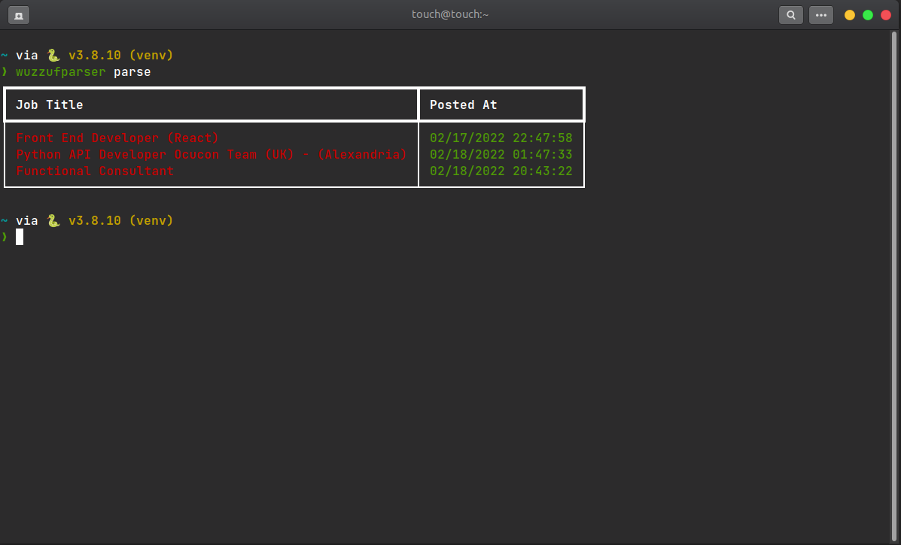
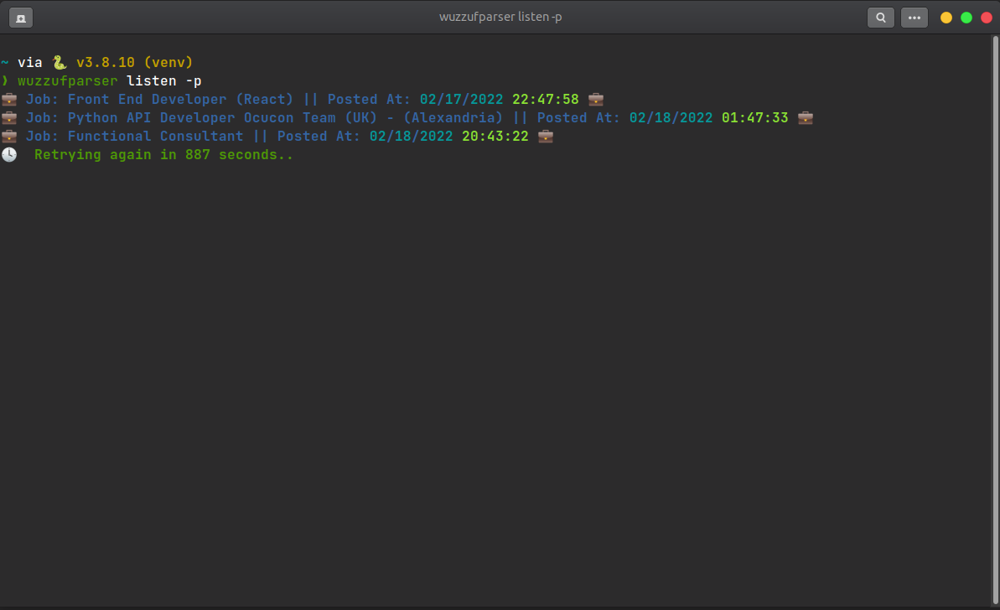
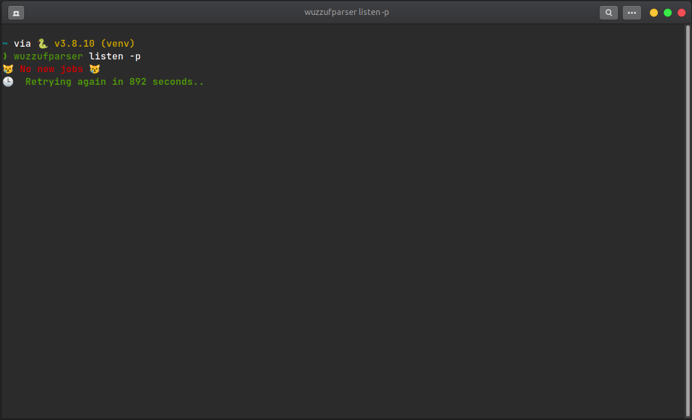
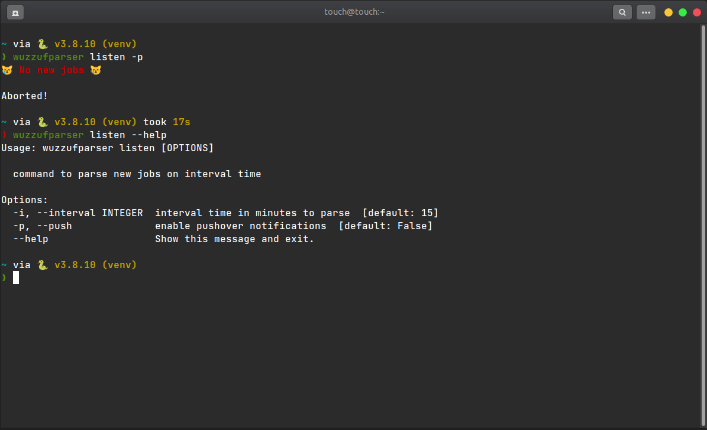
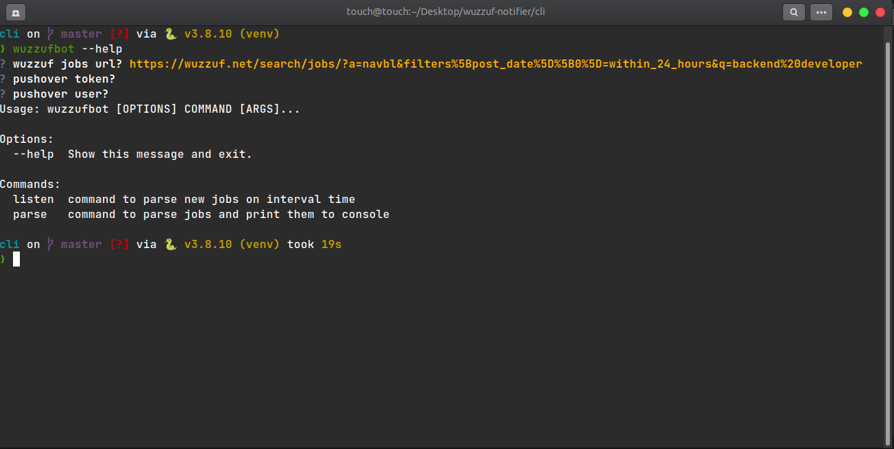

<h1 align="center">WuzzufBot cli tool</h1>

## About
wuzzufbot is cli tool to parse https://wuzzuf.net/ job page, listen on interval time for new jobs, print them to console add push notifications using https://pushover.net/. 

## Screenshots

<p align="center"></p>
<p align="center"></p>
<p align="center"></p>
<p align="center"></p>
<p align="center"></p>

## Prerequisites

- python3
- pip

## Installation

1. Clone the repo
   ```sh
   git clone https://github.com/your_username_/wuzzuf-bot.git
   ```
2. update pip
   ```sh
   pip install -U pip
   ```
3. update setuptools
   ```sh
   pip install -U setuptools
   ```
4. install (make sure you are on directory where setup.py)
   ```sh
   pip install .
   ```

## Usage

1. ```sh
   wuzzufbot --help
   ```
2. you will be asked at first time for wuzzuf-url , pushover token , pushover user --> make sure to provide at least wuzzuf jobs url
